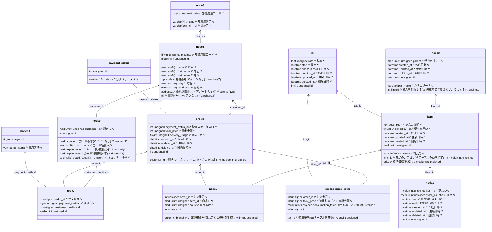

```mermaid
classDiagram
direction BT
class node9 {
   mediumint unsigned customer_id  /* 顧客ID */
   card_number  /* カード番号(ハイフンなし) */ varchar(16)
   varchar(20) card_name  /* カード名義人 */
   card_expire_month  /* カード利用期限(月) */ decimal(2)
   card_expire_year  /* カード利用期限(年) */ decimal(5)
   decimal(3) card_security_number  /* セキュリティ番号 */
   int unsigned id
}
class node5 {
   varchar(64) name  /* 氏名 */
   varchar(64) first_name  /* 名前 */
   varchar(64) last_name  /* 姓 */
   zip_code  /* 郵便番号(ハイフンなし) */ varchar(7)
   tinyint unsigned province  /* 都道府県コード */
   varchar(128) city  /* 町名 */
   varchar(128) address1  /* 番地 */
   address2  /* 番地以降(ビル・アパート名など) */ varchar(128)
   tel  /* 電話番号(-ハイフンなし) */ varchar(16)
   mediumint unsigned id
}
class node1 {
   mediumint unsigned item_id  /* 商品ID */
   mediumint unsigned stock_count  /* 在庫数 */
   datetime start  /* 取り扱い開始日時 */
   datetime end  /* 取り扱い終了日 */
   datetime created_at  /* 作成日時 */
   datetime updated_at  /* 更新日時 */
   datetime deleted_at  /* 削除日時 */
   mediumint unsigned id
}
class item {
   varchar(1024) name  /* 商品名 */
   text description  /* 商品の説明 */
   kind_id  /* 商品のカテゴリ(別テーブルのIDを指定) */ mediumint unsigned
   price  /* 標準価格(税抜) */ mediumint unsigned
   tinyint unsigned tax_id  /* 税率適用ID */
   datetime created_at  /* 作成日時 */
   datetime updated_at  /* 更新日時 */
   datetime deleted_at  /* 削除日時 */
   mediumint unsigned id
}
class node3 {
   varchar(16) name  /* カテゴリー名 */
   mediumint unsigned parent  /* 親カテゴリー */
   is_limited  /* 購入を制限する(ex.未成年者が買えないようにする) */ tinyint(1)
   datetime created_at  /* 作成日時 */
   datetime updated_at  /* 更新日時 */
   datetime deleted_at  /* 削除日時 */
   mediumint unsigned id
}
class orders {
   customer_id  /* 顧客ID(注文してくれたお客さんを特定) */ mediumint unsigned
   int unsigned payment_status_id  /* 決済ステータスID */
   int unsigned total_price  /* 請求金額 */
   tinyint unsigned delivery_usage  /* 配送方法 */
   datetime created_at  /* 作成日時 */
   datetime updated_at  /* 更新日時 */
   datetime deleted_at  /* 削除日時 */
   int unsigned id
}
class node7 {
   int unsigned order_id  /* 注文番号 */
   order_id_branch  /* 注文詳細番号(商品ごとに枝番を生成) */ tinyint unsigned
   mediumint unsigned item_id  /* 商品ID */
   mediumint unsigned count  /* 商品個数 */
   int unsigned id
}
class orders_price_detail {
   int unsigned order_id  /* 注文番号 */
   tax_id  /* 適用税率(taxテーブルを参照) */ tinyint unsigned
   int unsigned total_price  /* 適用税率ごとの合計金額 */
   mediumint unsigned consumption_tax  /* 適用税率ごとの消費税の合計 */
   int unsigned id
}
class node0 {
   int unsigned order_id  /* 注文番号 */
   tinyint unsigned payment_method  /* 決済方法 */
   int unsigned customer_creditcard
   mediumint unsigned id
}
class node10 {
   varchar(8) name  /* 決済方法 */
   tinyint unsigned id
}
class payment_status {
   varchar(16) status  /* 決済ステータス */
   int unsigned id
}
class node8 {
   varchar(4) name  /* 都道府県名 */
   varchar(16) ei_mei  /* 英語名 */
   tinyint unsigned code  /* 都道府県コード */
}
class tax {
   float unsigned rate  /* 税率 */
   datetime start  /* 開始 */
   datetime end  /* 適用終了日時 */
   datetime created_at  /* 作成日時 */
   datetime updated_at  /* 更新日時 */
   datetime deleted_at  /* 削除日時 */
   tinyint unsigned id
}


node9  -->  node5 : customer_id
node5  -->  node8 : province
node1  -->  item : item_id
item  -->  node3 : kind_id
item  -->  tax : tax_id
orders  -->  node5 : customer_id
orders  -->  payment_status : payment_status_id
node7  -->  item : item_id
node7  -->  orders : order_id
orders_price_detail  -->  orders : order_id
orders_price_detail  -->  tax : tax_id
node0  -->  node9 : customer_creditcard
node0  -->  orders : order_id
node0  -->  node10 : payment_method
```
